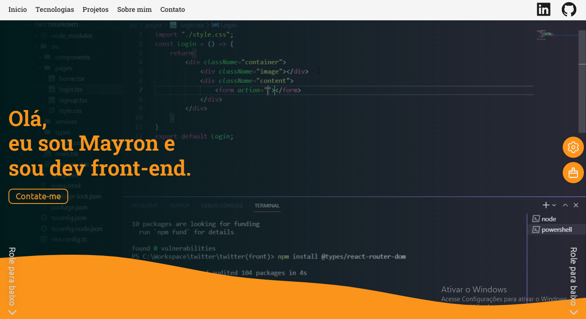

# Portfolio

## Preview 

## O que é?
Um site de apresentação dos meus trabalhos como programador, nele podem ser encontrados projetos 
alguns projetos que foram desenvolvidos ao longo do tempo, as tecnologias que mais utilizo, um pocuco sobre a minha historia, alem de algumas formas de entrar em contato.

## Como os dados são salvos?
O projeto possui uma integração com o <a href="https://firebase.google.com">firebase</a>. As tecnologias da sessão tecnologias e os projetos da sessão projetos são salvos no firestore database do firebase.  O firestore database é basicamento um banco de dados não relacional, que salva os dados em coleções diferentemente do banco de dados relacional que salva os dados em tabelas.

## Tecnologias utilizadas
- ReactJS
- TypeScript
- StyledComponents
- Firebase
- Google Maps API
- EmailJS

## Links
Site ao vivo: https://taskpomo.netlify.app  
LinkedIn: https://www.linkedin.com/in/mayron-fernandes/